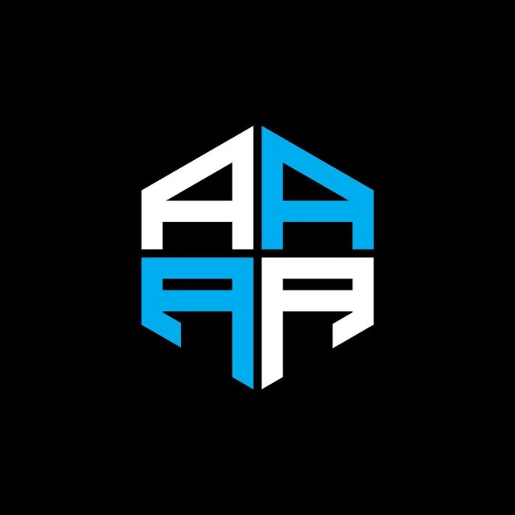

  
<!-- Animated Header -->

<!-- Badges with Animation -->

  
  
  
  

  

## 👥 Tim Pengembang

  <table>
    <tr>
      <td align="center" style="padding: 20px; background: linear-gradient(135deg, #667eea 0%, #764ba2 100%); border-radius: 15px; margin: 10px;">
        

          
          
👑

        

         
        <strong style="color: white; font-size: 18px;"><a href="https://github.com/scythe71" style="color: white; text-decoration: none;">Ammar</a></strong> 
        kapten
      </td>
      <td align="center" style="padding: 20px; background: linear-gradient(135deg, #f093fb 0%, #f5576c 100%); border-radius: 15px; margin: 10px;">
        
         
        <strong style="color: white; font-size: 18px;"><a href="https://github.com/Bangkah" style="color: white; text-decoration: none;">Atha</a></strong> 
         Developer
      </td>
      <td align="center" style="padding: 20px; background: linear-gradient(135deg, #4facfe 0%, #00f2fe 100%); border-radius: 15px; margin: 10px;">
        
         
        <strong style="color: white; font-size: 18px;"><a href="https://github.com/Arinisafitri29" style="color: white; text-decoration: none;">Arini</a></strong> 
        Developer
      </td>
      <td align="center" style="padding: 20px; background: linear-gradient(135deg, #fa709a 0%, #fee140 100%); border-radius: 15px; margin: 10px;">
        
         
        <strong style="color: white; font-size: 18px;"><a href="https://github.com/Ayuamelia79" style="color: white; text-decoration: none;">Ayu</a></strong> 
        Developer
      </td>
    </tr>
  </table>

---

  
## 🌟 Tentang Kami

**FOUR A TEAM** adalah tim developer elite beranggotakan 4 orang yang berfokus pada pengembangan aplikasi web modern menggunakan **Laravel 12** dan **Tailwind CSS**. 

Proyek flagship kami adalah **Sistem Absensi Karyawan** yang dikembangkan sebagai bagian dari mata kuliah *Workshop Web Lanjut* - sebuah implementasi nyata dari kerja tim profesional dan kolaborasi menggunakan **GitHub Organization**.

---

## 🎯 Visi & Misi

<table>
  <tr>
    <td align="center" style="width: 50%; padding: 20px; background: linear-gradient(135deg, #667eea 0%, #764ba2 100%); border-radius: 15px; color: white;">
      <h3>🎯 VISI</h3>
      
<strong>Menjadi tim pengembang yang solid, kreatif, dan konsisten dalam membangun proyek perangkat lunak yang bermanfaat.</strong>

    </td>
    <td align="center" style="width: 50%; padding: 20px; background: linear-gradient(135deg, #f093fb 0%, #f5576c 100%); border-radius: 15px; color: white;">
      <h3>🚀 MISI</h3>
      <ul style="text-align: left;">
        <li>✨ Mengembangkan aplikasi web dengan standar industri modern</li>
        <li>🎓 Meningkatkan keterampilan teknis dan kerja sama tim</li>
        <li>📚 Membiasakan budaya dokumentasi dan pengembangan profesional</li>
      </ul>
    </td>
  </tr>
</table>

---

## 📌 Deskripsi Proyek

### 🏢 Sistem Absensi Karyawan

Aplikasi web modern yang dibangun untuk revolutionizing workforce management:

  

<strong>👥 Manajemen Data</strong> 
• Kelola data pegawai, jabatan & hari libur 
• Dashboard role-based (Admin/Operator/Pegawai)

<strong>📱 Absensi Modern</strong> 
• QR Code scanning untuk check-in/out 
• Input manual sebagai backup option

<strong>📝 Pengajuan Izin</strong> 
• Sistem izin & cuti digital 
• Approval workflow yang terstruktur

<strong>📊 Laporan Analitik</strong> 
• Rekap absensi harian & bulanan 
• Export ke Excel untuk reporting

---

## ⚙️ Tech Stack

  <table>
    <tr>
      <td align="center" style="padding: 15px; background: #FF2D20; border-radius: 10px; color: white; margin: 5px;">
         
        <strong>Laravel 12</strong> 
        PHP 8.3 Framework
      </td>
      <td align="center" style="padding: 15px; background: #38B2AC; border-radius: 10px; color: white; margin: 5px;">
         
        <strong>Tailwind CSS 3</strong> 
        Utility-First CSS
      </td>
      <td align="center" style="padding: 15px; background: #4479A1; border-radius: 10px; color: white; margin: 5px;">
         
        <strong>MySQL 8.0</strong> 
        Reliable Database
      </td>
    </tr>
    <tr>
      <td align="center" style="padding: 15px; background: #8B5CF6; border-radius: 10px; color: white; margin: 5px;">
        <strong>🔐 Laravel Sanctum</strong> 
        Authentication
      </td>
      <td align="center" style="padding: 15px; background: #10B981; border-radius: 10px; color: white; margin: 5px;">
        <strong>📱 QR Code Library</strong> 
        Simple QR Code
      </td>
      <td align="center" style="padding: 15px; background: #F59E0B; border-radius: 10px; color: white; margin: 5px;">
        <strong>📊 Excel Export</strong> 
        Maatwebsite Excel
      </td>
    </tr>
  </table>

---

## 📄 Dokumentasi

<a href="./SRS.md" style="display: inline-block; padding: 15px 30px; background: linear-gradient(135deg, #667eea 0%, #764ba2 100%); color: white; text-decoration: none; border-radius: 50px; font-weight: bold; box-shadow: 0 8px 25px rgba(102, 126, 234, 0.3); transition: transform 0.3s ease;" onmouseover="this.style.transform='translateY(-3px)'" onmouseout="this.style.transform='translateY(0px)'">
  📋 Software Requirements Specification (SRS)
</a>

---

## 🏆 Leaderboard Kontributor

  
<h3 style="color: #2d3436; margin-bottom: 20px;">🎯 Most Valuable Players</h3>

  
<!-- LEADERBOARD:START -->
<table style="width: 100%; border-collapse: collapse;">
  <tr style="background: #6c5ce7; color: white;">
    <th style="padding: 15px; border-radius: 10px 0 0 0;">🏆 Rank</th>
    <th style="padding: 15px;">👤 Developer</th>
    <th style="padding: 15px;">📊 Contributions</th>
    <th style="padding: 15px; border-radius: 0 10px 0 0;">🎁 Reward</th>
  </tr>
  <tr style="text-align: center; background: #f8f9fa;">
    <td colspan="4" style="padding: 20px; color: #6c5ce7; font-style: italic;">
      📊 Leaderboard akan diupdate secara otomatis...
    </td>
  </tr>
</table>
<!-- LEADERBOARD:END -->

  <strong>🎁 Hadiah spesial menanti untuk anggota paling aktif dari Kapten Ammar!</strong>

---

## 🤝 Kontribusi

  
<h3>💡 Punya Ide Brilian?</h3>

Meskipun repositori ini fokus untuk pengembangan internal tim, kami selalu terbuka untuk:
- 💭 **Diskusi** tentang best practices
- 🚀 **Saran** untuk improvement
- 🐛 **Bug reports** melalui Issues

<a href="../../issues" style="display: inline-block; margin-top: 15px; padding: 10px 25px; background: rgba(255,255,255,0.2); color: white; text-decoration: none; border-radius: 25px; font-weight: bold; backdrop-filter: blur(10px); transition: transform 0.3s ease;" onmouseover="this.style.transform='scale(1.05)'" onmouseout="this.style.transform='scale(1)'">
  📝 Submit Your Ideas
</a>

---

## 📬 Kontak Tim

<h3>🤝 Mari Berkolaborasi!</h3>

Ingin berdiskusi atau berkolaborasi dengan tim kami? 
<strong>Hubungi kami untuk networking & knowledge sharing!</strong>

⚠️ <em>Ralat saat ini hanya menerima member untuk berdiskusi dan berkolaborasi heheh</em>

## 📜 Lisensi

  
<strong>🎓 Academic Project</strong> 
Proyek ini bersifat akademik dan digunakan untuk keperluan pembelajaran. 
<em>All rights reserved to FOUR A TEAM © 2024</em>

---

  

